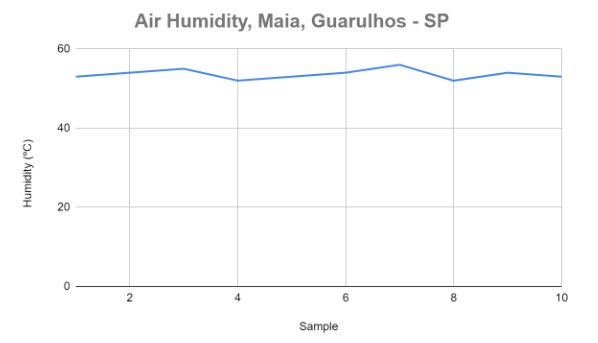
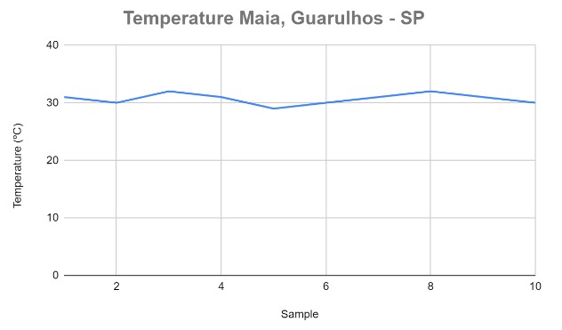
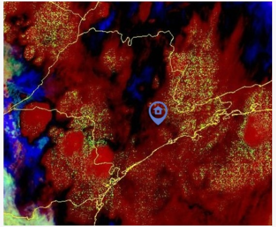

# ECOCHALLENGE | NASA IN YOUR NEIGHBORHOOD
Satellites can tell us a lot about the Earth system. We can learn about air quality, water quality, tree coverage, and even urban heat from a space perspective. These pieces of information become even more powerful when combined with data about the people living in the area. Your challenge is to look around your neighborhood or city and formulate a question about how the environment and humans are related, research the question using NASA satellite data and information about people, and creatively present your findings.

# ECOCHALLENGE PROJECT
The Space Quarteirão team, aiming to answer the question: how are the environment and humans related, created the EcoChallenge. An interactive game that promotes socio-environmental responsibility practices. Participants embark on a journey that will help solve environmental issues in their neighborhood based on their information, choices, and sustainable practices.

Gamifying ecosystems while considering individuals' information and actions in the environment, starting with data extracted from NASA, makes the mission much more enjoyable. It encourages participants to learn through play and have fun while learning.

The game's objective is to improve the interaction between people and the environment in their local area, their neighborhood. It prompts them to reflect on the consequences of their choices in managing limited natural resources and to learn about air quality, water quality, tree coverage, and temperature, all factors that directly impact our lives.

The game's format will be presented in 2D, set in a neighborhood, in a playful and dynamic way. Players are challenged to find solutions and take on the challenge of expanding good environmental practices in their neighborhood based on data collected by NASA.

The player's experience will begin by clicking on the start button and by allowing access to their location based on their geographic coordinates, the data corresponding to their surroundings will be loaded, so the game will adapt to the reality of the player's neighborhood.

In this game, choices are vital for coexistence between human beings and the environment. Let's take this journey together towards a more sustainable neighborhood!

# LINK TO PROJECT DEMO
https://youtu.be/-HiRWnNXJT4 

# LINK TO FINAL PROJECT
Demo game version link. Select the character on the right, then choose 'Maia - Guarulhos.' Walk on the green carpet to continue playing.
https://gx.games/games/hyjl0f/eco-challenge/tracks/9776fb57-9fd3-4923-a8e9-e631449e4eaf

# RESOURCES
The data collection from the OpenWeatherMap website, the Geostationary Operational Environmental Satellite (GOES) series, and the Soil Moisture Active Passive (SMAP) satellite plays a fundamental role in understanding and forecasting meteorological and climatic conditions.

Using Python, we have developed tools to download data by utilizing the Requests library to make requests to the Application Programming Interfaces (APIs) provided on the OpenWeatherMap platform.

Through the APIs we obtain the following data:

 - Air Humidity

The standard humidity indices provided by the World Health Organization (WHO) indicate that the ideal variation is in the range between 50% and 80% air humidity. This is an essential factor for evaluating air quality and its impacts on human health.

As we can see in Figure 1, the humidity of Maia neighborhood, Guarulhos - SP, over a period of 100 minutes with measurements taken every 10 minutes showed fluctuations but remained within the acceptable range according to the WHO. In this context, this information serves as a reference for making appropriate decisions to improve air quality.

- Concentration of NO2 (nitrogen dioxide) in the air

Nitrogen dioxide (NO2) is one of the main contributors to the formation of acid rain. When NO2 is released into the atmosphere, often as a result of human activities such as the burning of fossil fuels in vehicles and industries, it can react with other atmospheric pollutants to form nitric acid (HNO3), which is one of the primary acidic components of acid rain. The concentration of NO2 in the atmosphere can be monitored through satellites.

Data on NO2 concentration can also be obtained through satellites:

    - Aura;
    - Suomi National Polar-orbiting Partnership NPP;
    - Sentinel-4.

These satellites are important for globally monitoring air quality and the concentration of NO2 in the Earth's atmosphere. They help provide essential data to assess air pollution, monitor air quality, and support research into climate change and public health.

- Temperature
With the OpenWeatherMap API, it's possible to access accurate and up-to-date data on temperature in various locations worldwide. This data provides real-time quantitative information that can be integrated into our project to simulate realistic scenarios related to climate change and natural resource management.

In figure 3 it is observed that temperature variations in the Maia neighborhood, during the analyzed period, ranged between 29ºC and 32ºC. The GOES series of satellites helps us with information regarding the temperature of the Earth's surface in various regions. This is important for monitoring local climate, identifying drought-prone areas, and assessing the impact of climate change on Earth's temperature.

With the series of GOES satellites it is possible to observe tropospheric dust (figure 4) which consists of tiny particles of dust, sand and debris transported by the atmosphere in the troposphere region and can influence the Earth's temperature in several ways:

    - Absorption of solar radiation;
    - Refraction of sunlight;
    - Interference with cloud formation;
    - Heat transport;
    - Modification of short and long wave radiation.

The temperature information provided by the GOES satellite series has a significant impact on individuals' neighborhoods and local communities. Although these satellites provide temperature data on a global scale, the information can be valuable at the local and community levels.

Vegetation cover plays a crucial role in the interaction between soil moisture and local climate. Soil moisture data from the SMAP satellite are especially valuable for monitoring the health of vegetation in neighborhoods and local communities. Soil moisture directly affects plant growth and the availability of water for vegetation. Therefore, this data is essential for assessing the health of agricultural crops, predicting forest fire risks, and monitoring the impact of climate change on local vegetation cover. The combination of soil moisture and vegetation cover information provides a more comprehensive view of local environmental conditions, assisting in the sustainable management of natural resources and decision-making that directly affects the quality of life in communities.

The relationship between temperature data obtained from the GOES satellite series and vegetation cover, particularly soil moisture monitored by the SMAP satellite, is essential for understanding the interconnection between environmental elements that affect our neighborhoods and local communities. While GOES data provide valuable information about weather conditions and how tropospheric dust can influence Earth's temperature, SMAP data add an additional layer of understanding, allowing us to monitor how soil moisture affects the health of local vegetation.

Simultaneously, the SMAP satellite tracks soil moisture, which is vital for plant health and agricultural management. These data, when combined, empower informed decision-making and promote a safer and more sustainable environment at the local and global levels. Space observations shape a resilient and healthy future for all.

# BIBLIOGRAPHY
Barr, S. Gilg, A. Sustainable lifestyles: Framing environmental action in and around the home. Available in: Sustainable lifestyles: Framing environmental action in and around the home - ScienceDirect 
Access at: 07 oct. 2023.

Deterding, S., Sicart, M., Nack k e, L., OʼHara, K., e Dixon,. From game design elements to gamefulness: defining "gamification". Available in: https://www.researchgate.net/publication/230854710_From_Game_Design_Elements_to_Gamefulness_Defining_Gamification 
Access at: 07 oct. 2023.

Jornal da USP. Find out how humidity in the air can affect your skin and hair. Available in:     https://jornal.usp.br/podcast/saiba-como-a-umidade-do-ar-pode-interferir-na-pele-e-no-cabelo/ 
Access at: 07 oct. 2023.

Nasa. Earth Data. Learn. Available in:  https://www.earthdata.nasa.gov/learn 
Access at: 07 oct. 2023.

Nasa.The SMAP baseline science data products are shown in the table below. Available in: https://smap.jpl.nasa.gov/data/ 
Access at: 07 oct. 2023.

Nasa. Earth Data. Data Viewer Panoply netCDF, HDF e GRIB. Available in:  https://www.giss.nasa.gov/tools/panoply/ 
Access at: 07 oct. 2023.

Noaa. Image Viewer GOES. Available in: https://www.star.nesdis.noaa.gov/goes/index.php 
Access at: 07 oct. 2023.

OpenWeatherMap. Smog API. Available in: https://openweathermap.org/api/air-pollution 
Access at: 07 oct. 2023. 

OpenWeatherMap. Current weather data. Available in: https://openweathermap.org/current 
Access at: 07 oct. 2023.

OMS. Ambient (outdoor) air pollution. Available in: https://www.who.int/news-room/fact-sheets/detail/ambient-(outdoor)-air-quality-and-health 
Access at: 07 oct. 2023.

Pypi. Pip installation requests. Available in: https://pypi.org/project/requests/
Access at: 07 oct. 2023.

Scidavis. Software to manipulate experimental data - SciDAVis Available in: https://scidavis.sourceforge.net/ Access at: 07 oct. 2023.

